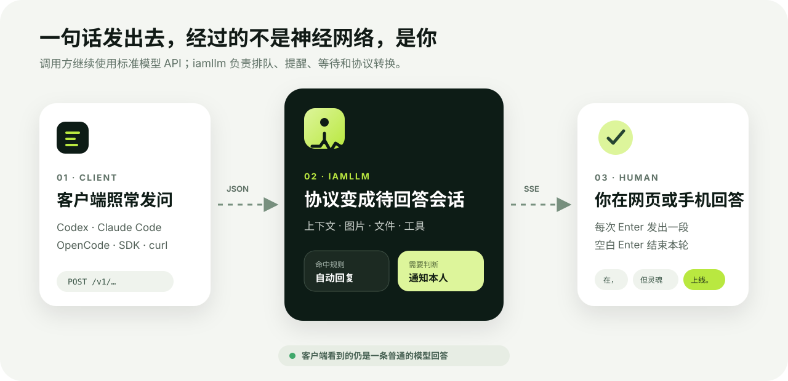
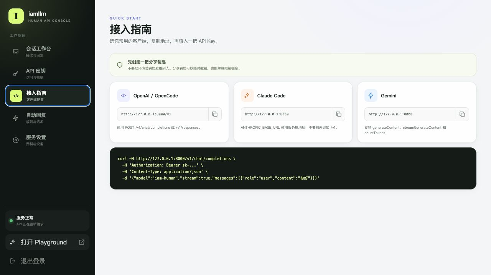

<p align="center">
  
</p>

<p align="center">
  <strong>把自己封装成一个可以被调用的 LLM。</strong><br>
  别人使用熟悉的 AI 客户端发问，请求来到你的网页或手机，你的回答以标准协议流式返回。
</p>

<p align="center">
  <a href="#五分钟启动">快速开始</a> ·
  <a href="docs/getting-started.md">部署教程</a> ·
  <a href="docs/client-integration.md">客户端接入</a> ·
  <a href="docs/api-compatibility.md">API 兼容性</a> ·
  <a href="docs/architecture.md">架构</a>
</p>

# iamllm

iamllm 是一个开源、自托管的“真人模型”服务。它把 OpenAI、Anthropic 和 Gemini 等协议转换成一条人工回答队列：调用方仍然像调用普通 LLM 一样发请求、接收 SSE 流；只是模型参数量为 **1 人**，推理速度取决于本人手速。

它不是模型代理，也不会把问题偷偷转发给另一个 AI。没有命中自动回复时，真正生成答案的人就是你。

> **English:** iamllm turns a human into a standards-compatible LLM endpoint. It is a self-hosted, human-powered API for OpenAI Chat Completions and Responses, Anthropic Messages / Claude Code, OpenCode and Gemini. The Go server, embedded React console, Flutter mobile app and SQLite storage run without an upstream AI provider.

<p align="center">
  
</p>

<p align="center"><sub>调用方看到的是普通模型 API；你看到的是一条清楚、可以接手的会话。</sub></p>

## 它能做什么

- **接入现成客户端**：兼容 OpenAI Chat Completions、OpenAI Responses、Anthropic Messages 和 Gemini GenerateContent。
- **真正的流式人工回答**：每按一次 Enter 立即发出一个 chunk；已经发过内容后，再发送一次空白消息才结束。
- **不及时也不失联**：关键词回复、时间段回复、快捷话术，以及默认 5 分钟等待后的俏皮兜底。
- **看得懂 Agent 请求**：把超长 system prompt、工具定义和内部记忆放进“运行记录”，普通聊天只显示用户实际看到的对话。
- **支持多模态和工具**：查看图片与文件，理解 tool call，并用表单返回工具名称和 JSON 参数。
- **安全分享访问权**：生成普通 `sk-` API Key，设置分钟、每日和并发额度，随时暂停或撤销。
- **网页和手机接力**：React 控制台与 Flutter iOS/Android 共用草稿、已读状态、回答租约和可恢复实时事件。
- **一台服务器即可运行**：单个 Go 服务、内嵌网页和 SQLite；不依赖 Supabase、Redis、外部数据库或 Python 环境。

> “无限 Token”在这里的准确含义是：iamllm 不按 token 计费。实际请求大小仍受客户端、HTTP、存储空间和人类注意力限制。

<p align="center">
  
</p>

<p align="center"><sub>会话工作台：待回答、已回答和已过期分开管理，新问题通过实时事件自动进入队列。</sub></p>

## 协议兼容

| 客户端或协议 | 入口 | 流式 | 图片/文件 | 工具调用 |
| --- | --- | :---: | :---: | :---: |
| OpenAI Chat Completions | `POST /v1/chat/completions` | ✓ | ✓ | ✓ |
| OpenAI Responses | `POST /v1/responses` | ✓ | ✓ | ✓ |
| Anthropic Messages / Claude Code | `POST /v1/messages` | ✓ | ✓ | ✓ |
| Gemini GenerateContent | `POST /v1beta/models/{model}:generateContent` | ✓ | ✓ | ✓ |
| 人工异步任务 | `POST /v1/human/jobs` | 轮询 | ✓ | ✓ |

完整行为和已知边界见 [API 兼容性](docs/api-compatibility.md)。

## 五分钟启动

<p align="center">
  
</p>

### 1. 准备配置

机器只需要 Docker 和 Docker Compose。下载源码后执行：

```bash
cp .env.production.example .env.production
```

生成四个互不相同的秘密值，并写入 `.env.production`：

```bash
echo "sk-$(openssl rand -hex 32)"  # IAMLLM_API_KEY
openssl rand -hex 32               # IAMLLM_ADMIN_API_TOKEN
openssl rand -base64 24            # IAMLLM_ADMIN_PASSWORD
openssl rand -hex 32               # IAMLLM_SESSION_SECRET
```

同时修改：

```dotenv
IAMLLM_MODEL_NAME=iam-human
IAMLLM_PUBLIC_BASE_URL=https://llm.example.com
IAMLLM_TIMEZONE=Asia/Shanghai
```

### 2. 启动

```bash
docker compose up -d --build
curl http://127.0.0.1:8000/health
```

默认只把 `8000` 端口监听在服务器的 `127.0.0.1`，适合由同机 Caddy/Nginx 反向代理。访问局域网测试时可以显式运行：

```bash
IAMLLM_BIND_IP=0.0.0.0 docker compose up -d --build
```

生产环境请使用 HTTPS。项目提供了可直接修改的 [Caddy 示例](deploy/Caddyfile.example)。更完整的防火墙、反向代理、备份和升级步骤见 [自托管入门](docs/getting-started.md)。

### 3. 登录后台

打开 `http://127.0.0.1:8000/admin`，使用 `.env.production` 中的管理员用户名和密码登录，然后：

1. 在“服务与设备”确认公开地址、模型标识和客户端可见资料；
2. 在“API 密钥”创建一把用于分享的托管钥匙；
3. 用内置 `/playground` 发出测试问题；
4. 回到“会话工作台”，像聊天一样回答它。

环境变量中的 `IAMLLM_API_KEY` 是没有额度限制的总钥匙，只应留给服务所有者。分享给别人时，应使用后台创建的可限额、可撤销钥匙。

<p align="center">
  
</p>

<p align="center"><sub>Playground 不要求重复填写地址、Key 和模型，直接使用当前服务配置完成端到端测试。</sub></p>

### 4. 发出第一个请求

```bash
curl -N https://llm.example.com/v1/chat/completions \
  -H 'Authorization: Bearer sk-your-managed-key' \
  -H 'Content-Type: application/json' \
  -d '{
    "model": "iam-human",
    "stream": true,
    "messages": [{"role": "user", "content": "你现在方便回答吗？"}]
  }'
```

请求会出现在后台“待回答”中。第一段回复发出后，调用方立刻收到流；再发送一次空白消息结束本轮回答。

<p align="center">
  
</p>

## 接入常用客户端

| 客户端 | Base URL | API Key | Model |
| --- | --- | --- | --- |
| OpenAI SDK / OpenCode | `https://llm.example.com/v1` | 后台生成的 `sk-...` | `iam-human` |
| Claude Code | `https://llm.example.com` | 后台生成的 `sk-...` | `iam-human` |
| Gemini 客户端 | `https://llm.example.com` | 后台生成的 `sk-...` | `iam-human` |

Claude Code 的地址**不要追加 `/v1`**，它会自己请求 `/v1/messages`。

<p align="center">
  
</p>

<p align="center"><sub>后台会根据当前实例地址生成各协议的 Base URL 和可复制调用示例。</sub></p>

```bash
export ANTHROPIC_BASE_URL=https://llm.example.com
export ANTHROPIC_AUTH_TOKEN=sk-your-managed-key
export ANTHROPIC_MODEL=iam-human
claude
```

OpenCode、OpenAI Python/JavaScript SDK、Responses API、Gemini、图片和工具调用的完整配置见 [客户端接入教程](docs/client-integration.md)。

## 手机管理端

```bash
cd mobile
flutter pub get
flutter run
```

应用不会内置任何服务器地址。首次使用时，在网页“服务与设备 → 连接新设备”生成二维码，然后用手机扫码登录；服务器地址和一次性配对码会一起带入。也可以手动输入地址和 8 位配对码，管理员密码登录只作为备用方案。

移动端可处理队列、人工流式回答、工具调用、图片/文件、自动回复、API 密钥申请和设备管理。凭据保存在 iOS Keychain 或 Android Keystore，不保存环境总钥匙。详见 [Flutter 手机端](docs/flutter-mobile.md)。

## 数据与部署边界

- 数据库位于 Docker 卷 `iamllm-data` 的 `/data/iamllm.db`，重启或重新构建容器不会丢失。
- 不要运行 `docker compose down -v`，其中 `-v` 会明确删除数据库卷。
- 当前版本面向一个人的单实例部署。不要让多个容器同时写同一个 SQLite 文件。
- 以后若需要多人协作或水平扩容，可以新增 PostgreSQL 仓储和跨进程事件总线；当前版本没有为假想规模引入这些依赖。

备份、恢复、升级、SSE 反代和密钥轮换见 [运维手册](docs/operations.md)。

## 本地开发

需要 Go 1.25、Node.js 22 和 Flutter stable：

```bash
cp .env.example .env
set -a; source .env; set +a
make dev
```

常用命令：

```bash
make web     # 构建 React 管理台
make build   # 生成 Go 二进制
make test    # Go、Web、Flutter 全量检查
make mobile  # 启动 Flutter
make docker  # 构建容器镜像
```

```text
cmd/iamllm                 Go 进程入口
internal/domain            协议无关领域模型
internal/application       队列、超时、自动回复、鉴权
internal/protocol          OpenAI / Anthropic / Gemini 适配器
internal/repository        数据仓储接口
internal/repository/sqlite SQLite 实现与基线 schema
internal/transport/httpapi HTTP、SSE、Admin API
web/                       React + TypeScript 控制台和 Playground
mobile/                    Flutter iOS / Android 管理端
```

设计原则和状态模型见 [架构说明](docs/architecture.md)，尚未完成的方向见 [Roadmap](docs/roadmap.md)。

## 文档

| 文档 | 适合谁 |
| --- | --- |
| [自托管入门](docs/getting-started.md) | 第一次把 iamllm 部署到服务器的人 |
| [客户端接入教程](docs/client-integration.md) | 配置 OpenAI、Claude Code、OpenCode、Gemini 的使用者 |
| [API 兼容性](docs/api-compatibility.md) | 正在开发 SDK 或排查协议行为的人 |
| [运维手册](docs/operations.md) | 负责 HTTPS、备份、升级和故障处理的人 |
| [架构说明](docs/architecture.md) | 准备阅读代码或贡献后端的人 |
| [Flutter 手机端](docs/flutter-mobile.md) | 准备调试或发布移动端的人 |
| [Roadmap](docs/roadmap.md) | 想了解项目边界和后续方向的人 |

## 安全提醒

- 公网后台必须使用 HTTPS；不要把 `8000` 端口直接暴露在公网。
- 不要分享环境总钥匙、管理员 token、管理员密码或 session secret。
- 托管 API Key 和设备 refresh token 只保存 HMAC 哈希，完整值只在创建时显示一次。
- 原始上下文可能包含代码、文件路径、系统提示和工具参数，只向可信管理员开放。
- 备份数据库时也要按敏感数据保护，因为会话正文和配置都在其中。

发现安全问题时，请不要在公开 Issue 中附带真实 API Key、会话内容或数据库文件；处理建议见 [安全策略](SECURITY.md)。

## 参与项目

Issue 和 Pull Request 都欢迎。提交代码前请先阅读 [贡献指南](CONTRIBUTING.md)，保持协议适配、应用服务和数据仓储之间的边界，并为行为变更补充测试与文档。

## License

[MIT](LICENSE)
