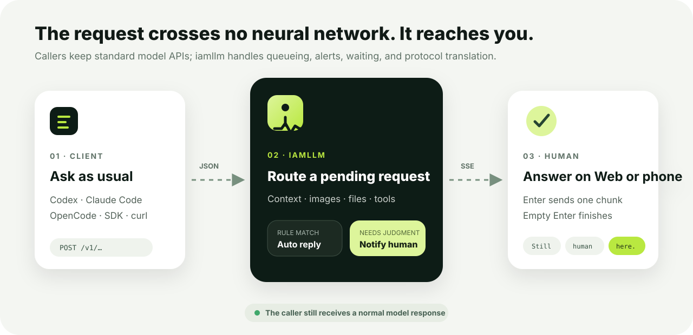
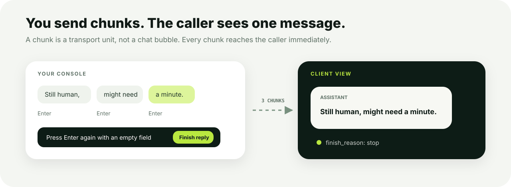
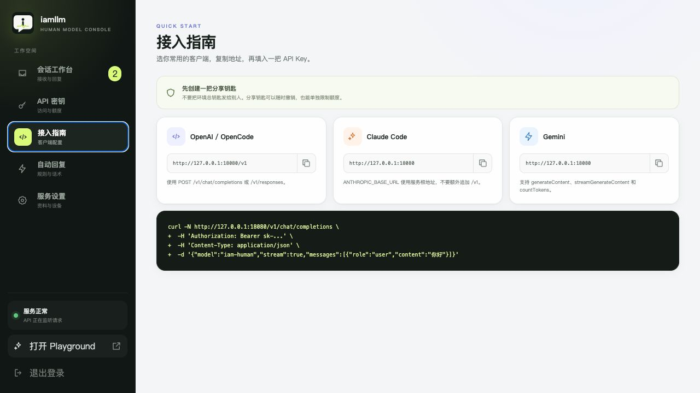
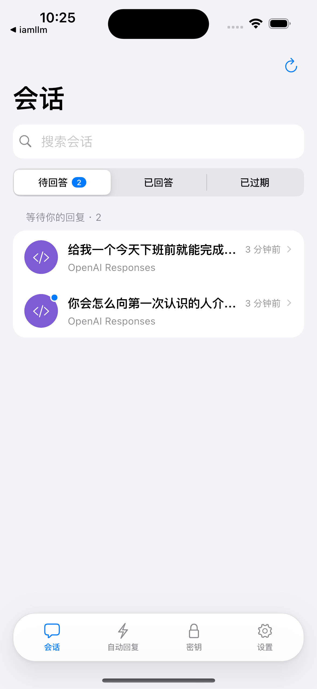
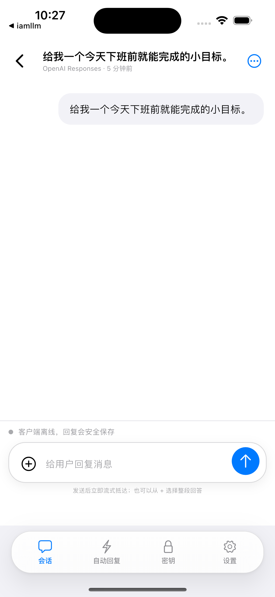
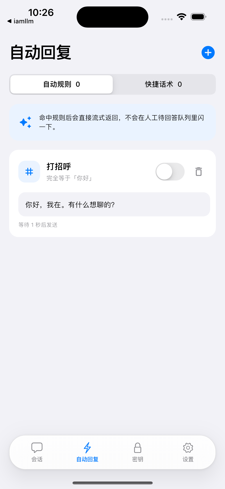
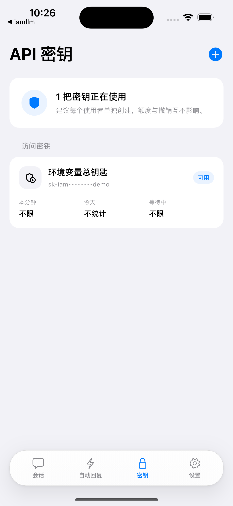

<p align="center">
  
</p>

<p align="center">
  <strong>English</strong> · <a href="README.zh-CN.md">简体中文</a>
</p>

<p align="center">
  <strong>Package yourself as an LLM that existing clients can call.</strong><br>
  Questions arrive in your web console or phone, and your human replies stream back through familiar model APIs.
</p>

<p align="center">
  <a href="#five-minute-setup">Quick start</a> ·
  <a href="docs/en/getting-started.md">Deployment</a> ·
  <a href="docs/en/client-integration.md">Client setup</a> ·
  <a href="docs/en/api-compatibility.md">API compatibility</a> ·
  <a href="docs/en/architecture.md">Architecture</a>
</p>

# iamllm

iamllm is an open-source, self-hosted “human model” service. It turns OpenAI, Anthropic, and Gemini requests into a queue for a real person: callers still send normal model requests and receive native SSE streams, while the model has **one human parameter** and inference speed depends on typing speed.

It is not an AI proxy and does not secretly forward unanswered requests to another model. Unless an automation rule matches, the person running the instance writes the answer.

<p align="center">
  
</p>

## What it does

- **Works with existing clients:** OpenAI Chat Completions and Responses, Anthropic Messages, and Gemini GenerateContent.
- **Human streaming:** each Enter sends one chunk immediately; after at least one chunk, an empty Enter finishes the response.
- **Stays responsive while you are away:** keyword rules, schedules, quick replies, and a playful five-minute timeout fallback.
- **Makes agent traffic readable:** large system prompts, tool definitions, and internal memory live in a run log while the main chat shows the user-visible conversation.
- **Handles multimodal requests and tools:** inspect images and files, read tool schemas, and return tool names plus JSON arguments.
- **Shares access safely:** issue ordinary `sk-` API keys with per-minute, daily, and concurrency limits; pause or revoke them at any time.
- **Web and mobile handoff:** React and Flutter share drafts, read state, answer leases, and resumable realtime events.
- **Runs on one server:** one Go service with an embedded web app and SQLite—no Supabase, Redis, external database, or Python runtime required.

> “Unlimited tokens” means iamllm does not charge by token. Client limits, HTTP body limits, storage, and human attention still apply.

<p align="center">
  
</p>

<p align="center"><sub>The real web console separates pending, answered, and expired conversations and updates the queue in realtime.</sub></p>

## Protocol compatibility

| Client or protocol | Endpoint | Streaming | Images/files | Tools |
| --- | --- | :---: | :---: | :---: |
| OpenAI Chat Completions | `POST /v1/chat/completions` | ✓ | ✓ | ✓ |
| OpenAI Responses | `POST /v1/responses` | ✓ | ✓ | ✓ |
| Anthropic Messages / Claude Code | `POST /v1/messages` | ✓ | ✓ | ✓ |
| Gemini GenerateContent | `POST /v1beta/models/{model}:generateContent` | ✓ | ✓ | ✓ |
| Human async jobs | `POST /v1/human/jobs` | Polling | ✓ | ✓ |

See [API compatibility](docs/en/api-compatibility.md) for exact behavior and known boundaries.

## Five-minute setup

<p align="center">
  
</p>

### 1. Configure

The host only needs Docker and Docker Compose:

```bash
cp .env.production.example .env.production
```

Generate four different secrets and place them in `.env.production`:

```bash
echo "sk-$(openssl rand -hex 32)"  # IAMLLM_API_KEY
openssl rand -hex 32               # IAMLLM_ADMIN_API_TOKEN
openssl rand -base64 24            # IAMLLM_ADMIN_PASSWORD
openssl rand -hex 32               # IAMLLM_SESSION_SECRET
```

Set your public identity:

```dotenv
IAMLLM_MODEL_NAME=iam-human
IAMLLM_PUBLIC_BASE_URL=https://llm.example.com
IAMLLM_TIMEZONE=Asia/Shanghai
```

### 2. Start

```bash
docker compose up -d --build
curl http://127.0.0.1:8000/health
```

Port `8000` binds to the server loopback interface by default so Caddy or Nginx can proxy it safely. For temporary LAN testing:

```bash
IAMLLM_BIND_IP=0.0.0.0 docker compose up -d --build
```

Use HTTPS in production. A ready-to-edit [Caddy example](deploy/Caddyfile.example) and complete firewall, proxy, backup, and upgrade instructions are in [Getting started](docs/en/getting-started.md).

### 3. Finish setup in the console

Open `http://127.0.0.1:8000/admin`, sign in with the administrator credentials from `.env.production`, then:

1. Confirm the public URL and model identifier under **Service & devices**.
2. Create a managed key under **API keys**.
3. Send a test question from `/playground`.
4. Answer it from the **Conversation desk**.

`IAMLLM_API_KEY` is the unlimited owner key. Keep it private; share managed, revocable keys instead.

<p align="center">
  
</p>

### 4. Call it

```bash
curl -N https://llm.example.com/v1/chat/completions \
  -H 'Authorization: Bearer sk-your-managed-key' \
  -H 'Content-Type: application/json' \
  -d '{
    "model": "iam-human",
    "stream": true,
    "messages": [{"role": "user", "content": "Are you free to answer?"}]
  }'
```

The request appears in the pending queue. The caller receives each chunk as soon as you send it; send an empty message after the first chunk to finish.

<p align="center">
  
</p>

## Connect clients

| Client | Base URL | API key | Model |
| --- | --- | --- | --- |
| OpenAI SDK / OpenCode | `https://llm.example.com/v1` | managed `sk-...` | `iam-human` |
| Claude Code | `https://llm.example.com` | managed `sk-...` | `iam-human` |
| Gemini clients | `https://llm.example.com` | managed `sk-...` | `iam-human` |

Do **not** append `/v1` to the Claude Code base URL; Claude Code adds `/v1/messages` itself.

<p align="center">
  
</p>

```bash
export ANTHROPIC_BASE_URL=https://llm.example.com
export ANTHROPIC_AUTH_TOKEN=sk-your-managed-key
export ANTHROPIC_MODEL=iam-human
claude
```

See [Client integration](docs/en/client-integration.md) for OpenCode, OpenAI Python/JavaScript SDKs, Responses, Gemini, images, and tool calls.

## Mobile administration

```bash
cd mobile
flutter pub get
flutter run
```

The app never hard-codes an instance address. Generate a QR code under **Service & devices → Connect a device**; scanning it transfers the server URL and a one-time pairing code. Manual URL/code entry and administrator login remain fallback options.

The Flutter app handles the queue, human streaming, tools, attachments, automation, API-key requests, and device management. Credentials stay in iOS Keychain or Android Keystore.

<p align="center">
  
  
  
  
</p>

<p align="center"><sub>Rendered by the repository's Flutter app connected to an isolated demo instance on an iPhone 15 Pro simulator.</sub></p>

## Data and deployment boundaries

- SQLite lives at `/data/iamllm.db` in the `iamllm-data` Docker volume. Container restarts and rebuilds do not erase it.
- Do not run `docker compose down -v`; `-v` explicitly deletes the database volume.
- The current release is a single-instance product for one human model. Do not let multiple containers write the same SQLite file.
- PostgreSQL and a cross-process event bus only become necessary for real multi-administrator or horizontal-scaling requirements.

See [Operations](docs/en/operations.md) for backup, restore, upgrades, SSE proxying, and key rotation.

## Local development

Requires Go 1.25, Node.js 22, and Flutter stable:

```bash
cp .env.example .env
set -a; source .env; set +a
make dev
```

```bash
make web     # build the React console
make build   # build the Go binary
make test    # run Go, Web, and Flutter checks
make mobile  # launch Flutter
make docker  # build the container image
```

```text
cmd/iamllm                 Go entry point
internal/domain            protocol-neutral domain types
internal/application       queue, timeout, automation, authentication
internal/protocol          OpenAI / Anthropic / Gemini adapters
internal/repository        persistence contracts
internal/repository/sqlite SQLite implementation and baseline schema
internal/transport/httpapi HTTP, SSE, and Admin API
web/                       React + TypeScript console and Playground
mobile/                    Flutter iOS / Android application
```

## Documentation

| Document | Purpose |
| --- | --- |
| [Getting started](docs/en/getting-started.md) | Deploy a first public instance |
| [Client integration](docs/en/client-integration.md) | Configure OpenAI, Claude Code, OpenCode, and Gemini clients |
| [API compatibility](docs/en/api-compatibility.md) | Implement or troubleshoot protocol clients |
| [Operations](docs/en/operations.md) | HTTPS, backup, upgrade, and recovery |
| [Architecture](docs/en/architecture.md) | Understand and contribute to the backend |
| [Flutter mobile](docs/en/flutter-mobile.md) | Run or ship the mobile admin app |
| [Roadmap](docs/en/roadmap.md) | Product boundaries and future work |

## Security

- Use HTTPS for every public instance; do not expose port `8000` directly to the internet.
- Never share the owner key, administrator token, password, or session secret.
- Managed API keys and device refresh tokens are stored as HMAC hashes; full values are shown only once.
- Raw context can contain source code, local paths, system prompts, and tool arguments. Only trusted administrators should access it.
- Protect database backups as sensitive conversation data.

See the [Security policy](SECURITY.md) before reporting a vulnerability.

## Contributing

Issues and pull requests are welcome. Read [CONTRIBUTING.md](CONTRIBUTING.md) before changing public APIs, persistence, or user flows.

## License

[MIT](LICENSE)
