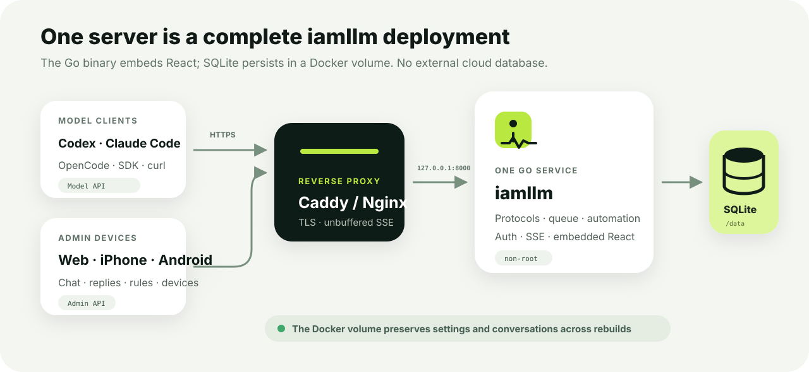
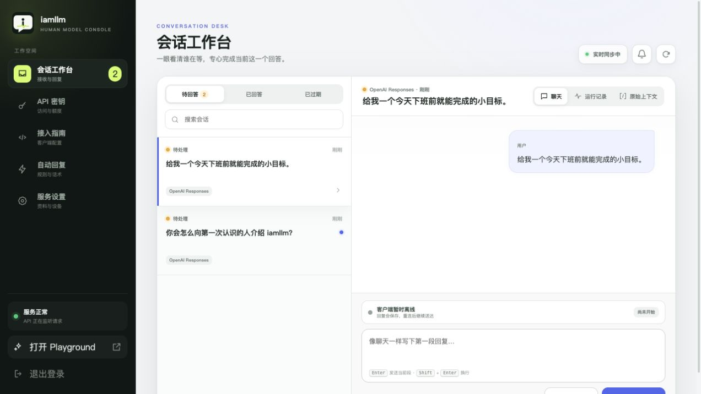
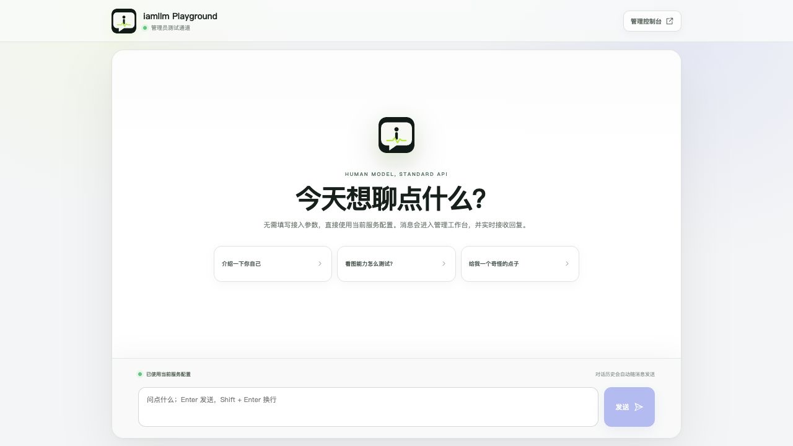

# Self-hosting guide

[English](getting-started.md) · [简体中文](../zh-CN/getting-started.md)

This guide turns a clean Linux server into a public iamllm instance over HTTPS. The default deployment uses only Docker, Caddy, and SQLite—no Supabase, Redis, PostgreSQL, or Python.



All components can run on one machine. Caddy terminates HTTPS and flushes SSE immediately; iamllm owns protocols, queues, and administration; SQLite persists in a Docker volume.

## 1. Requirements

- A Linux server that stays online. One CPU core and 1 GB RAM are enough to start.
- Docker Engine and Docker Compose v2.
- A domain name resolving to the server's public IP.
- Public `80/tcp` and `443/tcp`; port `8000` does not need public access.
- A computer for the web console; the mobile app is optional.

Without a domain, test over HTTP on a trusted LAN. Never send administrator credentials or API keys over plaintext internet connections.

## 2. Get the source

Download a release or clone your fork, then:

```bash
cd iamllm
cp .env.production.example .env.production
chmod 600 .env.production
```

Never commit `.env.production`.

## 3. Generate secrets

Run each command independently and use every result once:

```bash
echo "sk-$(openssl rand -hex 32)"
openssl rand -hex 32
openssl rand -base64 24
openssl rand -hex 32
```

Assign them to:

```dotenv
IAMLLM_API_KEY=sk-...
IAMLLM_ADMIN_API_TOKEN=...
IAMLLM_ADMIN_PASSWORD=...
IAMLLM_SESSION_SECRET=...
```

| Setting | Purpose | Share? |
| --- | --- | --- |
| `IAMLLM_API_KEY` | Unlimited environment owner key | No |
| `IAMLLM_ADMIN_API_TOKEN` | Emergency/automation Admin API access | No |
| `IAMLLM_ADMIN_PASSWORD` | Initial web administrator login | No |
| `IAMLLM_SESSION_SECRET` | Signs administrator sessions | No |

Set public identity separately:

```dotenv
IAMLLM_ADMIN_USERNAME=admin
IAMLLM_MODEL_NAME=iam-human
IAMLLM_PUBLIC_BASE_URL=https://llm.example.com
IAMLLM_TIMEZONE=Asia/Shanghai
```

Use a short lowercase model identifier with letters, digits, and hyphens. The public URL must not end in `/v1`.

## 4. Start the service

```bash
docker compose up -d --build
docker compose ps
curl http://127.0.0.1:8000/health
```

Inspect startup logs with:

```bash
docker compose logs -f --tail=100 iamllm
```

### Loopback and LAN binding

Compose binds the host port to `127.0.0.1:8000` by default. Caddy on the same server can reach it while internet and LAN devices cannot bypass the proxy. This is the recommended production configuration.

For temporary LAN testing:

```bash
IAMLLM_BIND_IP=0.0.0.0 docker compose up -d
```

Compose interpolation reads the current shell or the project-root `.env`, not the service's `env_file: .env.production`. Changing only `IAMLLM_BIND_IP` inside `.env.production` does not change host-port binding.

## 5. Add HTTPS

Install Caddy, copy the [example Caddyfile](../../deploy/Caddyfile.example), and replace the hostname:

```caddyfile
llm.example.com {
    reverse_proxy 127.0.0.1:8000 {
        flush_interval -1
    }
    encode zstd gzip
}
```

`flush_interval -1` forwards SSE chunks immediately rather than buffering human replies.

After DNS resolves to the server, reload Caddy and verify:

```bash
curl https://llm.example.com/health
```

For Nginx, disable buffering and extend timeouts:

```nginx
location / {
    proxy_pass http://127.0.0.1:8000;
    proxy_http_version 1.1;
    proxy_buffering off;
    proxy_cache off;
    proxy_read_timeout 600s;
    proxy_send_timeout 600s;
}
```

## 6. Complete initial setup

Open `https://llm.example.com/admin` and sign in with `IAMLLM_ADMIN_USERNAME` and `IAMLLM_ADMIN_PASSWORD`.

Recommended order:

1. **Service & devices:** confirm public URL, model identifier, and caller-visible profile.
2. **Automation:** configure off-hours messages, common answers, and quick replies.
3. **API keys:** create and save the first managed `sk-` key.
4. **Playground:** send a test question.
5. **Conversation desk:** send one chunk, then an empty message to finish.

A managed key is displayed once. If lost, revoke it and create another instead of searching the database for plaintext.



An empty queue after first startup is expected. The web page does not need to remain open for the model API to work; realtime events add new requests whenever it is open.

## 7. Verify model access

```bash
export IAMLLM_URL=https://llm.example.com
export IAMLLM_KEY=sk-your-managed-key

curl "$IAMLLM_URL/v1/models" \
  -H "Authorization: Bearer $IAMLLM_KEY"
```

Send a non-streaming request:

```bash
curl "$IAMLLM_URL/v1/chat/completions" \
  -H "Authorization: Bearer $IAMLLM_KEY" \
  -H 'Content-Type: application/json' \
  -d '{
    "model": "iam-human",
    "messages": [{"role": "user", "content": "Reply with: deployment works"}]
  }'
```

The command waits for a human answer. Add `-N` and `"stream": true` to observe every chunk.



Alternatively, open `/playground` to test the complete question → queue → human reply → stream path with the current administrator session.

## 8. Connect a phone

Choose **Connect a device** under **Service & devices**. The generated QR code contains:

- the instance HTTPS URL;
- an eight-character one-time pairing code;
- a ten-minute expiry.

The Flutter app imports the address and pairs automatically. Each device receives an independently revocable refresh token; removing a device does not revoke model API keys.

See [Flutter mobile administration](flutter-mobile.md) for local runs and release preparation.

## 9. Next steps

- [Configure Claude Code, OpenCode, and SDKs](client-integration.md)
- [Set up backups, upgrades, and key rotation](operations.md)
- [Review protocol differences](api-compatibility.md)
- [Understand the architecture](architecture.md)
