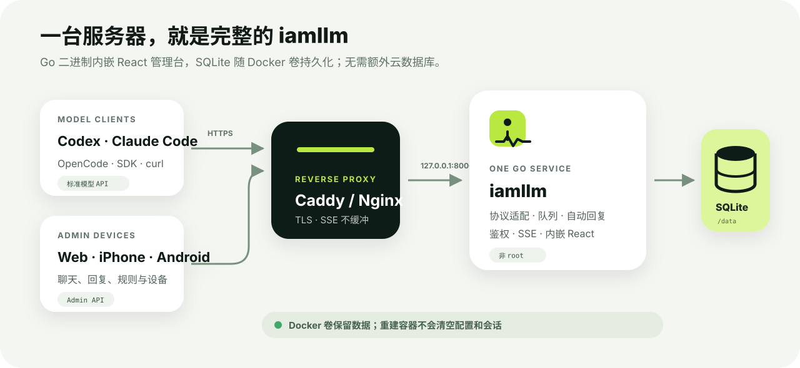
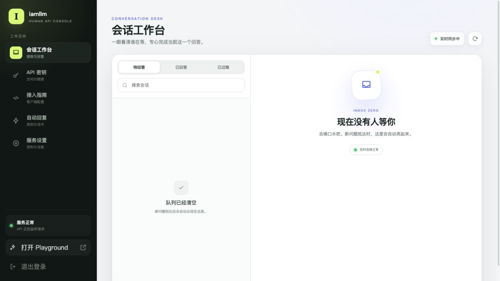
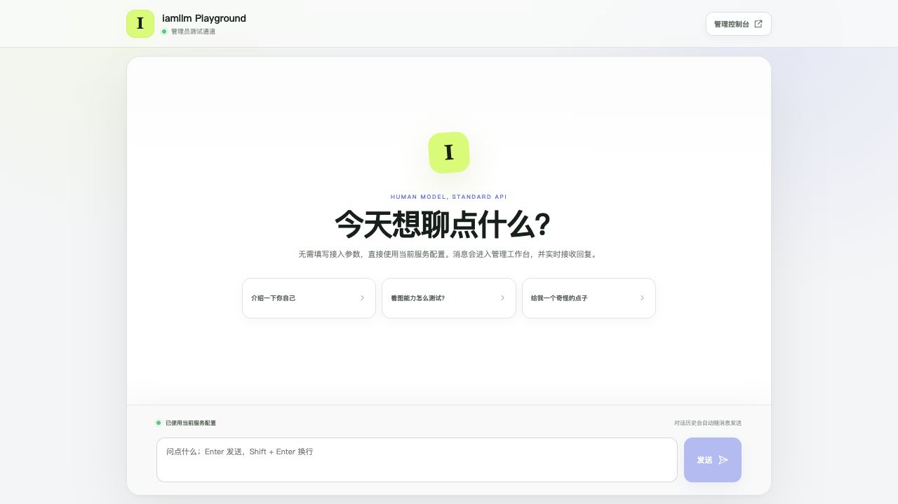

# 自托管入门

这份教程把一台空白 Linux 服务器变成可通过 HTTPS 调用的 iamllm 实例。默认方案只使用 Docker、Caddy 和 SQLite，不需要 Supabase、Redis、PostgreSQL 或 Python。



图中所有服务都可以放在同一台机器：Caddy 负责 HTTPS 和即时转发 SSE，iamllm 负责协议、队列和后台，SQLite 数据保存在 Docker 卷中。

## 1. 准备什么

- 一台可以长期运行的 Linux 服务器；1 核 CPU、1 GB 内存足以开始体验；
- Docker Engine 与 Docker Compose v2；
- 一个解析到服务器公网 IP 的域名；
- 开放 `80/tcp` 和 `443/tcp`，不必对公网开放 `8000/tcp`；
- 一台能打开网页控制台的电脑，手机端是可选项。

没有域名时可以先在局域网用 HTTP 测试，但不要通过公网明文传输管理员密码或 API Key。

## 2. 获取源码

下载项目源码或克隆你自己的仓库，然后进入项目目录：

```bash
cd iamllm
cp .env.production.example .env.production
```

`.env.production` 不应提交到 Git。建议只有当前系统用户可读：

```bash
chmod 600 .env.production
```

## 3. 生成秘密值

分别执行下面的命令，每个输出只使用一次：

```bash
echo "sk-$(openssl rand -hex 32)"
openssl rand -hex 32
openssl rand -base64 24
openssl rand -hex 32
```

把结果依次填入：

```dotenv
IAMLLM_API_KEY=sk-...
IAMLLM_ADMIN_API_TOKEN=...
IAMLLM_ADMIN_PASSWORD=...
IAMLLM_SESSION_SECRET=...
```

这些值用途不同，不能复用：

| 配置 | 用途 | 是否分享 |
| --- | --- | --- |
| `IAMLLM_API_KEY` | 无额度限制的环境总钥匙 | 否 |
| `IAMLLM_ADMIN_API_TOKEN` | 管理 API 的紧急/自动化访问 | 否 |
| `IAMLLM_ADMIN_PASSWORD` | 网页管理员首次登录 | 否 |
| `IAMLLM_SESSION_SECRET` | 签发后台 session | 否 |

然后填写公开信息：

```dotenv
IAMLLM_ADMIN_USERNAME=admin
IAMLLM_MODEL_NAME=iam-human
IAMLLM_PUBLIC_BASE_URL=https://llm.example.com
IAMLLM_TIMEZONE=Asia/Shanghai
```

模型名是别人配置客户端时看到的标识，建议使用简短的小写英文、数字和连字符。公开地址不要以 `/v1` 结尾。

## 4. 启动服务

```bash
docker compose up -d --build
docker compose ps
curl http://127.0.0.1:8000/health
```

健康检查成功会返回服务状态。查看启动日志：

```bash
docker compose logs -f --tail=100 iamllm
```

### 本地与局域网监听的区别

Compose 默认把宿主机端口绑定到 `127.0.0.1:8000`。这意味着同一台服务器上的 Caddy 能访问，但公网和局域网设备不能绕过反向代理直连，属于推荐的生产配置。

临时进行局域网测试时，可以改为：

```bash
IAMLLM_BIND_IP=0.0.0.0 docker compose up -d
```

注意：Compose 的 `${IAMLLM_BIND_IP}` 插值读取当前 shell 或项目根目录的 `.env`，不会读取服务的 `env_file: .env.production`。因此只修改 `.env.production` 中的同名变量，不会改变宿主机端口绑定。

## 5. 配置 HTTPS

安装 Caddy 后，把 [Caddyfile 示例](../deploy/Caddyfile.example) 复制到 Caddy 配置目录，并把域名改成自己的：

```caddyfile
llm.example.com {
    reverse_proxy 127.0.0.1:8000 {
        flush_interval -1
    }
    encode zstd gzip
}
```

`flush_interval -1` 用于立即转发 SSE chunk，避免你已经回答，但客户端过一会儿才一起显示。

确认 DNS 已指向服务器后，重新加载 Caddy，再检查：

```bash
curl https://llm.example.com/health
```

如果使用 Nginx，需要关闭响应缓冲并延长读取超时，例如：

```nginx
location / {
    proxy_pass http://127.0.0.1:8000;
    proxy_http_version 1.1;
    proxy_buffering off;
    proxy_cache off;
    proxy_read_timeout 600s;
    proxy_send_timeout 600s;
}
```

## 6. 完成首次设置

打开 `https://llm.example.com/admin`，使用 `IAMLLM_ADMIN_USERNAME` 和 `IAMLLM_ADMIN_PASSWORD` 登录。

建议按以下顺序设置：

1. **服务与设备**：确认公开地址、模型标识和客户端可见资料；
2. **自动回复**：配置建议工作时间之外的回复、常见问题和快捷话术；
3. **API 密钥**：创建第一把托管 `sk-` 钥匙并保存；
4. **Playground**：发一条测试消息；
5. **会话工作台**：发送一段回复，再发送空白消息结束。

完整托管 Key 只展示一次。丢失后不要尝试从数据库找回，直接撤销并生成新钥匙。



初次启动时队列为空是正常状态。保持页面打开并不影响 API；新请求到达后，左侧列表会自动更新。

## 7. 验证模型接口

先读取模型列表：

```bash
export IAMLLM_URL=https://llm.example.com
export IAMLLM_KEY=sk-your-managed-key

curl "$IAMLLM_URL/v1/models" \
  -H "Authorization: Bearer $IAMLLM_KEY"
```

再发一个非流式请求：

```bash
curl "$IAMLLM_URL/v1/chat/completions" \
  -H "Authorization: Bearer $IAMLLM_KEY" \
  -H 'Content-Type: application/json' \
  -d '{
    "model": "iam-human",
    "messages": [{"role": "user", "content": "请回复：部署成功"}]
  }'
```

命令会等待后台人工回答。要观察每一段输出，加入 `-N` 并在 JSON 中设置 `"stream": true`。



如果不想先写 curl，可以直接打开 `/playground`。它使用当前服务的模型和管理员会话，适合验证“发问 → 进入队列 → 人工回答 → 流式返回”整个链路。

## 8. 连接手机

在网页“服务与设备”选择“连接新设备”，页面会生成包含以下信息的二维码：

- 当前实例的 HTTPS 地址；
- 8 位一次性配对码；
- 10 分钟有效期。

Flutter 应用扫码后会自动填写地址并配对。每台设备都有独立且可撤销的 refresh token；移除设备不会影响模型 API Key。

移动端运行和上架配置见 [Flutter 手机管理端](flutter-mobile.md)。

## 9. 下一步

- [配置 Claude Code、OpenCode 和 SDK](client-integration.md)
- [设置备份、升级与密钥轮换](operations.md)
- [查看协议差异](api-compatibility.md)
- [理解代码架构](architecture.md)
