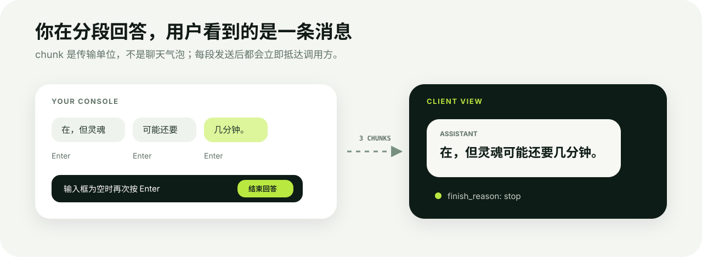

# 客户端接入教程

[English](../en/client-integration.md) · [简体中文](client-integration.md)

iamllm 的目标是让调用方把它当作普通模型服务。通常只需要三项信息：

```text
服务地址：https://llm.example.com
API Key： sk-...
模型名：   iam-human
```

本文中的地址、Key 和模型名都是示例，请替换成实例自己的值。用于分享的 Key 应在网页“API 密钥”中创建，不要使用环境总钥匙。

## 接入前先自检

```bash
export IAMLLM_URL=https://llm.example.com
export IAMLLM_KEY=sk-your-managed-key
export IAMLLM_MODEL=iam-human

curl "$IAMLLM_URL/health"
curl "$IAMLLM_URL/v1/models" \
  -H "Authorization: Bearer $IAMLLM_KEY"
```

如果这两步都成功，再配置具体客户端。不同协议的 Base URL 不完全相同：

| 用法 | 填写的 Base URL |
| --- | --- |
| OpenAI SDK、OpenCode | `https://llm.example.com/v1` |
| Claude Code / Anthropic SDK | `https://llm.example.com` |
| Gemini REST | `https://llm.example.com` |


部署后的“接入指南”会用实例真实地址展示三类 Base URL，并给出可复制的 curl。教程中的 `llm.example.com` 只是占位符。

## OpenAI Chat Completions

### curl

```bash
curl -N "$IAMLLM_URL/v1/chat/completions" \
  -H "Authorization: Bearer $IAMLLM_KEY" \
  -H 'Content-Type: application/json' \
  -d "{
    \"model\": \"$IAMLLM_MODEL\",
    \"stream\": true,
    \"messages\": [
      {\"role\": \"system\", \"content\": \"回答简洁一点\"},
      {\"role\": \"user\", \"content\": \"你好，你是谁？\"}
    ]
  }"
```

### Python SDK

```python
import os
from openai import OpenAI

client = OpenAI(
    api_key=os.environ["IAMLLM_KEY"],
    base_url="https://llm.example.com/v1",
)

stream = client.chat.completions.create(
    model="iam-human",
    stream=True,
    messages=[{"role": "user", "content": "给我讲个很短的笑话"}],
)

for event in stream:
    text = event.choices[0].delta.content
    if text:
        print(text, end="", flush=True)
```

### JavaScript SDK

```javascript
import OpenAI from "openai";

const client = new OpenAI({
  apiKey: process.env.IAMLLM_KEY,
  baseURL: "https://llm.example.com/v1",
});

const stream = await client.chat.completions.create({
  model: "iam-human",
  stream: true,
  messages: [{ role: "user", content: "你好" }],
});

for await (const event of stream) {
  process.stdout.write(event.choices[0]?.delta?.content ?? "");
}
```



回答者可以连续发送多个 chunk，但它们在协议和聊天语义上仍属于同一条助手消息。空白 Enter 只在已经发出至少一个 chunk 后代表结束。

## OpenAI Responses API

Responses API 适合使用 `input`、前序响应、后台任务或 Responses 风格工具调用的客户端。

```bash
curl -N "$IAMLLM_URL/v1/responses" \
  -H "Authorization: Bearer $IAMLLM_KEY" \
  -H 'Content-Type: application/json' \
  -d "{
    \"model\": \"$IAMLLM_MODEL\",
    \"stream\": true,
    \"input\": \"用一句话介绍你自己\"
  }"
```

创建后台响应：

```bash
curl "$IAMLLM_URL/v1/responses" \
  -H "Authorization: Bearer $IAMLLM_KEY" \
  -H 'Content-Type: application/json' \
  -d "{
    \"model\": \"$IAMLLM_MODEL\",
    \"background\": true,
    \"input\": \"想好以后再回答我\"
  }"
```

返回对象中的 `id` 可以用于：

```bash
curl "$IAMLLM_URL/v1/responses/resp_xxx" \
  -H "Authorization: Bearer $IAMLLM_KEY"
```

## Claude Code

Claude Code 使用 Anthropic Messages 协议。环境变量可以写进当前 shell 的启动脚本，也可以只在单次命令前设置：

```bash
export ANTHROPIC_BASE_URL=https://llm.example.com
export ANTHROPIC_AUTH_TOKEN=sk-your-managed-key
export ANTHROPIC_MODEL=iam-human

claude
```

关键点：

- `ANTHROPIC_BASE_URL` 不带 `/v1`，Claude Code 会自行追加 `/v1/messages`；
- 使用 `ANTHROPIC_AUTH_TOKEN`，iamllm 会接受它发送的 Bearer 鉴权；
- 模型名必须与 Claude Code 当前选中的模型一致；出现 “model identifier is invalid” 时，先检查 `ANTHROPIC_MODEL` 和 `/model`；
- Claude Code 会携带 system prompt、技能、工具 schema 和环境上下文。iamllm 将这些内容放进“运行记录”，聊天页主要显示用户可见消息。

Anthropic 官方的网关配置说明也使用 `ANTHROPIC_BASE_URL` 与 `ANTHROPIC_AUTH_TOKEN`，并明确 Base URL 不应追加 `/v1`：[Claude Code LLM gateway](https://docs.anthropic.com/en/docs/claude-code/llm-gateway)。

### 直接调用 Messages API

```bash
curl -N "$IAMLLM_URL/v1/messages" \
  -H "x-api-key: $IAMLLM_KEY" \
  -H 'anthropic-version: 2023-06-01' \
  -H 'Content-Type: application/json' \
  -d "{
    \"model\": \"$IAMLLM_MODEL\",
    \"max_tokens\": 1024,
    \"stream\": true,
    \"messages\": [{\"role\": \"user\", \"content\": \"你好\"}]
  }"
```

## OpenCode

OpenCode 可以添加一个 OpenAI-compatible 自定义 provider。当前稳定配置示例：

```json
{
  "$schema": "https://opencode.ai/config.json",
  "provider": {
    "iamllm": {
      "npm": "@ai-sdk/openai-compatible",
      "name": "iamllm",
      "options": {
        "baseURL": "https://llm.example.com/v1"
      },
      "models": {
        "iam-human": {
          "name": "iam-human"
        }
      }
    }
  }
}
```

保存为项目或用户级 `opencode.json` 后，在 OpenCode 中执行：

```text
/connect
Other
iamllm
sk-your-managed-key
```

然后用 `/models` 选择 `iamllm/iam-human`。如果希望从环境变量读取 Key，也可以在 provider 的 `options` 中加入：

```json
"apiKey": "{env:IAMLLM_KEY}"
```

OpenCode 的配置格式可能随版本变化；若本机版本不识别 `provider`，以官方 [Providers 文档](https://opencode.ai/docs/providers) 为准。使用 Chat Completions 兼容层时选择 `@ai-sdk/openai-compatible`；明确要求 OpenAI Responses 的客户端可改用官方文档所述的 `@ai-sdk/openai` provider。

OpenCode 在第一条用户消息附近，可能额外发送“生成标题”等内部请求。它们是不同的 API 调用，不是 iamllm 重复了用户消息；可以用自动回复处理，或在工作台“运行记录”中识别。

## Gemini

普通响应：

```bash
curl "$IAMLLM_URL/v1beta/models/$IAMLLM_MODEL:generateContent" \
  -H "x-goog-api-key: $IAMLLM_KEY" \
  -H 'Content-Type: application/json' \
  -d '{
    "contents": [{
      "role": "user",
      "parts": [{"text": "你好"}]
    }]
  }'
```

流式响应：

```bash
curl -N "$IAMLLM_URL/v1beta/models/$IAMLLM_MODEL:streamGenerateContent?alt=sse" \
  -H "x-goog-api-key: $IAMLLM_KEY" \
  -H 'Content-Type: application/json' \
  -d '{"contents":[{"role":"user","parts":[{"text":"分段回答我"}]}]}'
```

Gemini 鉴权同时接受 `x-goog-api-key`、Bearer 和查询参数 `key`。

## 图片与文件

OpenAI Chat Completions 图片示例：

```json
{
  "model": "iam-human",
  "messages": [{
    "role": "user",
    "content": [
      {"type": "text", "text": "这张图里有什么？"},
      {"type": "image_url", "image_url": {"url": "https://example.com/photo.jpg"}}
    ]
  }]
}
```

也可以传符合客户端协议的 base64 data URL。远程图片是否能预览取决于 iamllm 服务器能否访问对应地址；不要把只存在于调用方电脑的本地绝对路径当作公网附件。

后台附件读取接口需要管理员会话或设备 token，不会把原始受保护文件公开成匿名 URL。

## 工具调用

当客户端传入 `tools` 时，工作台会显示工具名、简介和参数 schema。回答者可以选择“调用客户端工具”，填写工具和 JSON 参数；iamllm 会按当前厂商协议生成 `tool_calls`、`function_call` 或 `tool_use`。

工具实际上在调用方执行，iamllm 服务器不会替你运行 shell、修改文件或访问客户端环境。客户端执行完后，通常会携带 tool result 发起下一次模型请求。

## 为什么一次聊天会出现多个请求

Codex、Claude Code、OpenCode 等 Agent 客户端不只请求“回答用户”，还可能单独请求：

- 生成会话标题；
- 整理记忆或压缩上下文；
- 规划下一步；
- 选择或执行工具；
- 失败后的自动重试。

因此“一次点击发送”不一定等于“一条模型 API 请求”。工作台把系统提示、工具 schema 和内部上下文折叠到“运行记录”，但无法替所有客户端猜测每个自定义提示的意图。稳定、可识别的内部任务适合配置自动回复。

## 常见错误

| 现象 | 原因与处理 |
| --- | --- |
| `401 Unauthorized` | Key 错误、已撤销、额度耗尽，或客户端没有发送 Bearer / `x-api-key`。先用 `/v1/models` 验证。 |
| `400 model identifier is invalid` | 客户端选中的模型与配置不一致。检查 `IAMLLM_MODEL_NAME`、客户端 Model 和 Claude Code `/model`。 |
| `404 /v1/responses` | Base URL 或服务版本错误。OpenAI Base URL 应为实例的 `/v1`，并确认运行的是包含 Responses API 的当前版本。 |
| 请求很久没有返回 | 它正在等待真人。查看后台队列、通知和 `IAMLLM_RESPONSE_TIMEOUT_SECONDS`。 |
| 回答最后一次性出现 | 反向代理缓冲了 SSE。Caddy 设置 `flush_interval -1`；Nginx 设置 `proxy_buffering off`。 |
| 第一条消息附近多出标题/记忆任务 | Agent 客户端发出的独立内部请求，不是重复 chunk。查看“运行记录”，并为固定提示设置自动回复。 |
| 工具调用后又来一条请求 | 正常流程：客户端执行工具，再把结果发给模型继续回答。 |
| 图片显示不出来 | 图片 URL 只在客户端本地可见、远程站点拒绝服务器访问，或附件需要管理员鉴权。 |
| 超时体感短 | 同时检查客户端超时、反向代理超时和 iamllm 的 300 秒默认超时；三者取最短值。 |

机器可读的接口定义始终以运行实例的 `/openapi.json` 为准。
